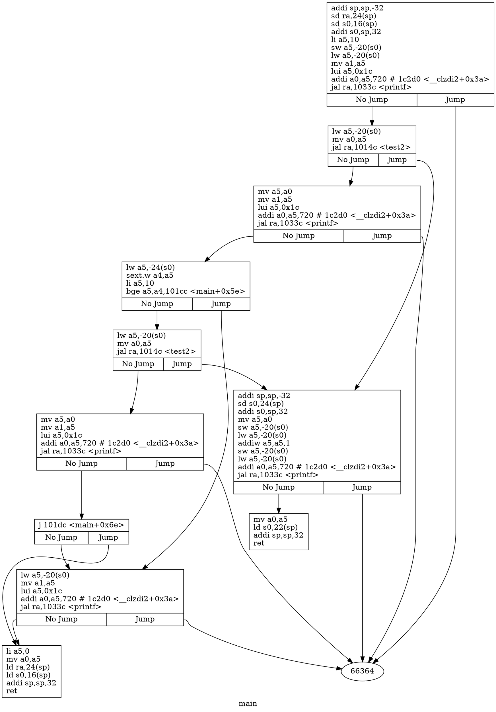

# rsicv asm2cfg
最近在研究disassembly 再找有沒有實際可以把asm轉成cfg的tool
https://github.com/Kazhuu/asm2cfg
找到是找到了但是只支援single function 和x86 和 arm
唯一比較有印象的是以前的ida pro


今天下午有空來幫改一下，
在Development 他也有說到可以新建環境
https://github.com/x213212/asm2cfg
```bash
pipenv install -d
pipenv shell
```
想離開開發環境就下
```bash
exit
```
在環境中要使用改動的後的asm2cfg呢
```bash
python -m src.asm2cfg -h

python -m src.asm2cfg -c examples/huge.asm
```

準備就緒就看一下大概改什麼

改動的地方為

#  add riscv info
可以選擇架構相容不同指令及架構我們抄arm 魔改一下
```python
    elif target_name == 'riscv':
        target_info = riscvTargetInfo()
```

```python

class riscvTargetInfo:
    """
    Contains instruction info for riscv-compatible targets.
    """

    def __init__(self):
        pass

    def comment(self):
        return '#'

    def is_call(self, instruction):
        # print(instruction)
        # Various flavors of call:
        #   call   *0x26a16(%rip)
        #   call   0x555555555542
        #   addr32 call 0x55555558add0
        return instruction.opcode in ('call')\
            and instruction.opcode not in ('beq', 'bne', 'blt', 'bge', 'bltu', 'bgeu')

    def is_jump(self, instruction):
        
        # print(instruction)
        return instruction.opcode in ('j', 'jle', 'jl', 'je', 'jne', 'jge','je','jal') and not self.is_call(instruction)
        # return instruction.opcode[0] == 'j'
    # def is_jump2(self, instruction):
    #     return instruction.opcode[0] == 'jal'
    def is_branch(self, instruction):
        # print(instruction)
        # Various flavors of call:
        #   call   *0x26a16(%rip)
        #   call   0x555555555542
        #   addr32 call 0x55555558add0
        return instruction.opcode in ('beq', 'bne', 'blt', 'bge', 'bltu', 'bgeu')
    def is_unconditional_jump(self, instruction):
        
        return instruction.opcode.startswith('jmp') 
        

    def is_sink(self, instruction):
        """
        Is this an instruction which terminates function execution e.g. return?
        """
        return instruction.opcode.startswith('ret')

```

# parse_lines
在判斷指令後作者他會抓取inst的 ops這邊我們直接取，整個程式碼架構沒有耦合太嚴重，很好改
在add riscv info章節，增加那些fucntion就是為了判斷，遇到branch 或者jump 指令，看指令種類取出ops(address)
```py
  # Infer target address for jump instructions
    for instruction in instructions:
        print(instruction)
        print(instruction.is_direct_jump2())
        print(instruction.is_branch_1())

        if (instruction.target is None or instruction.target.abs is None) \
                and instruction.is_direct_jump():
            if instruction.target is None:
                instruction.target = Address(0)
            instruction.target.abs = int(instruction.ops[0], 16)
        if (instruction.target is None or instruction.target.abs is None) \
                and instruction.is_direct_jump2():
            if instruction.target is None:
                instruction.target = Address(0)
            instruction.target.abs = int(instruction.ops[1], 16)
        if (instruction.target is None or instruction.target.abs is None) \
                and instruction.is_branch_1():
            if instruction.target is None:
                instruction.target = Address(0)
            instruction.target.abs = int(instruction.ops[2], 16)
```
# jump table
一樣增加 not inst.is_direct_jump2() 和 not inst.is_branch_1():
這邊我們就可以直接取到剛剛存進去的address
```python

class JumpTable:
    """
    Holds info about branch sources and destinations in asm function.
    """

    def __init__(self, instructions):
        # Address where the jump begins and value which address
        # to jump to. This also includes calls.
        self.abs_sources = {}
        self.rel_sources = {}

        # Addresses where jumps end inside the current function.
        self.abs_destinations = set()
        self.rel_destinations = set()

        # Iterate over the lines and collect jump targets and branching points.
        for inst in instructions:
            if inst is None or not inst.is_direct_jump() and  not inst.is_direct_jump2() \
                and  not inst.is_branch_1():
                continue

            # print(inst)
            # print("=====================")
            self.abs_sources[inst.address.abs] = inst.target
            self.abs_destinations.add(inst.target.abs)

            self.rel_sources[inst.address.offset] = inst.target
            self.rel_destinations.add(inst.target.offset)
```

# build riscv & output objdump
寫一個c 然後用 riscv64-unknown-elf-gcc 進行編譯
```c
#include <stdio.h>
int __attribute__((noinline))  test2 (int a){
	a=a+1;
	return a;
}
int main(){
	int	test =10;
	printf("%d\n",test);
	printf("%d\n",test2(test));
	int k ;
	if(k > 10)
	printf("%d\n",test2(test));
	else
	printf("%d\n",test);

	return 0;
}
```

```bash
riscv64-unknown-elf-gcc test.c
riscv64-unknown-elf-objdump -d ./a.out | sed -ne '/<main/,/^$/p' > a.asm
```
分別取出片段
# a.asm
```asm
000000000001016e <main>:
   1016e:	1101                	addi	sp,sp,-32
   10170:	ec06                	sd	ra,24(sp)
   10172:	e822                	sd	s0,16(sp)
   10174:	1000                	addi	s0,sp,32
   10176:	47a9                	li	a5,10
   10178:	fef42623          	sw	a5,-20(s0)
   1017c:	fec42783          	lw	a5,-20(s0)
   10180:	85be                	mv	a1,a5
   10182:	67f1                	lui	a5,0x1c
   10184:	2d078513          	addi	a0,a5,720 # 1c2d0 <__clzdi2+0x3a>
   10188:	1b4000ef          	jal	ra,1033c <printf>
   1018c:	fec42783          	lw	a5,-20(s0)
   10190:	853e                	mv	a0,a5
   10192:	fbbff0ef          	jal	ra,1014c <test2>
   10196:	87aa                	mv	a5,a0
   10198:	85be                	mv	a1,a5
   1019a:	67f1                	lui	a5,0x1c
   1019c:	2d078513          	addi	a0,a5,720 # 1c2d0 <__clzdi2+0x3a>
   101a0:	19c000ef          	jal	ra,1033c <printf>
   101a4:	fe842783          	lw	a5,-24(s0)
   101a8:	0007871b          	sext.w	a4,a5
   101ac:	47a9                	li	a5,10
   101ae:	00e7df63          	bge	a5,a4,101cc <main+0x5e>
   101b2:	fec42783          	lw	a5,-20(s0)
   101b6:	853e                	mv	a0,a5
   101b8:	f95ff0ef          	jal	ra,1014c <test2>
   101bc:	87aa                	mv	a5,a0
   101be:	85be                	mv	a1,a5
   101c0:	67f1                	lui	a5,0x1c
   101c2:	2d078513          	addi	a0,a5,720 # 1c2d0 <__clzdi2+0x3a>
   101c6:	176000ef          	jal	ra,1033c <printf>
   101ca:	a809                	j	101dc <main+0x6e>
   101cc:	fec42783          	lw	a5,-20(s0)
   101d0:	85be                	mv	a1,a5
   101d2:	67f1                	lui	a5,0x1c
   101d4:	2d078513          	addi	a0,a5,720 # 1c2d0 <__clzdi2+0x3a>
   101d8:	164000ef          	jal	ra,1033c <printf>
   101dc:	4781                	li	a5,0
   101de:	853e                	mv	a0,a5
   101e0:	60e2                	ld	ra,24(sp)
   101e2:	6442                	ld	s0,16(sp)
   101e4:	6105                	addi	sp,sp,32
   101e6:	8082                	ret

```
# a2.asm
```asm
000000000001014c <test2>:
   1014c:	1101                	addi	sp,sp,-32
   1014e:	ec22                	sd	s0,24(sp)
   10150:	1000                	addi	s0,sp,32
   10152:	87aa                	mv	a5,a0
   10154:	fef42623          	sw	a5,-20(s0)
   10158:	fec42783          	lw	a5,-20(s0)
   1015c:	2785                	addiw	a5,a5,1
   1015e:	fef42623          	sw	a5,-20(s0)
   10162:	fec42783          	lw	a5,-20(s0)
   101c2:	2d078513          	addi	a0,a5,720 # 1c2d0 <__clzdi2+0x3a>
   101c6:	176000ef          	jal	ra,1033c <printf>
   10166:	853e                	mv	a0,a5
   10168:	6462                	ld	s0,22(sp)
   1016a:	6105                	addi	sp,sp,32
   1016c:	8082                	ret

```
a2.asm 我多加了
```asm
   101c2:	2d078513          	addi	a0,a5,720 # 1c2d0 <__clzdi2+0x3a>
   101c6:	176000ef          	jal	ra,1033c <printf>
```
這從a.asm搬過來的，為了測試graphiz是否能產生分支

# command_line.py
最後避免過度耦合，先不考慮合併的情況，作者說不能支持多個fucntion，其實對於graphiz 來說只要共用同一個節點，線就會自動連上。
```python
"""
Command-line usage support.
"""

import argparse
from . import asm2cfg

def main():
    """ Command-line entry point to the program. """
    parser = argparse.ArgumentParser(
        description='Program to draw dot control-flow graph from GDB disassembly for a function.',
        epilog='If function CFG rendering takes too long, try to skip function calls with -c flag.'
    )
    parser.add_argument('assembly_file',
                        help='File to contain one function assembly dump')
    parser.add_argument('-c', '--skip-calls', action='store_true',
                        help='Skip function calls from dividing code to blocks')
    parser.add_argument('--target', choices=['x86', 'arm','riscv'], default='riscv',
                        help='Specify target platform for assembly')
    parser.add_argument('-v', '--view', action='store_true',
                        help='View as a dot graph instead of saving to a file')
    args = parser.parse_args()
    print('If function CFG rendering takes too long, try to skip function calls with -c flag')
    lines = asm2cfg.read_lines(args.assembly_file)
    function_name, basic_blocks = asm2cfg.parse_lines(lines, args.skip_calls, args.target)
    
    lines2 = asm2cfg.read_lines("/root/asm2cfg/a2.asm")
    function_name2, basic_blocks2 = asm2cfg.parse_lines(lines2, args.skip_calls, args.target)
    asm2cfg.draw_cfg(function_name, basic_blocks,function_name2, basic_blocks2, args.view)

```
# draw_cfg

```py
   
def draw_cfg(function_name, basic_blocks,function_name2, basic_blocks2, view):
    dot = Digraph(name=function_name, comment=function_name, engine='dot')
    dot.attr('graph', label=function_name)
    for address, basic_block in basic_blocks.items():
        key = str(address)
        dot.node(key, shape='record', label=basic_block.get_label())
    for basic_block in basic_blocks.values():
        if basic_block.jump_edge:
            if basic_block.no_jump_edge is not None:
                dot.edge(f'{basic_block.key}:s0', str(basic_block.no_jump_edge))
            dot.edge(f'{basic_block.key}:s1', str(basic_block.jump_edge))
        elif basic_block.no_jump_edge:
            dot.edge(str(basic_block.key), str(basic_block.no_jump_edge))
    # dot.attr('graph', label=function_name2)

    for address, basic_block in basic_blocks2.items():
        key = str(address)
        dot.node(key, shape='record', label=basic_block.get_label())
    for basic_block in basic_blocks2.values():
        if basic_block.jump_edge:
            if basic_block.no_jump_edge is not None:
                dot.edge(f'{basic_block.key}:s0', str(basic_block.no_jump_edge))
            dot.edge(f'{basic_block.key}:s1', str(basic_block.jump_edge))
        elif basic_block.no_jump_edge:
            dot.edge(str(basic_block.key), str(basic_block.no_jump_edge))
    # if view:
    dot.format = 'png'
    with tempfile.NamedTemporaryFile(mode='w+b', prefix=function_name) as filename:
        dot.view(filename.name)
        print(f'Opening a file {filename.name}.{dot.format} with default viewer. Don\'t forget to delete it later.')
    # else:
    #     dot.format = 'pdf'
    #     dot.render(filename=function_name, cleanup=True)
    #     print(f'Saved CFG to a file {function_name}.{dot.format}')
```
# output graphiz
```bash
python -m src.asm2cfg ./a.asm 
```


為的就是直接在markdown顯示

輸出png也是ok的
/tmp/main8ttsp644.png


指向66364原因就是找不到printf的程式碼無法產生節點
其中要撈取程式碼，
```bash
root@HOME-X213212:~/asm2cfg# gcc test.c
root@HOME-X213212:~/asm2cfg# gdb -batch -ex 'info functions' ./a.out 
All defined functions:

Non-debugging symbols:
0x0000000000001000  _init
0x0000000000001030  printf@plt
0x0000000000001040  __cxa_finalize@plt
0x0000000000001050  _start
0x0000000000001080  deregister_tm_clones
0x00000000000010c0  register_tm_clones
0x0000000000001110  __do_global_dtors_aux
0x0000000000001150  frame_dummy
0x000000000000115a  test2
0x000000000000116a  main
0x00000000000011f0  __libc_csu_init
0x0000000000001260  __libc_csu_fini
0x0000000000001268  _fini
```
這邊用這種方式也可以撈取，沒用riscv64-unknown-elf-gdb因為我少lib,老樣子如果靜態連結的話要畫出graphiz的圖可能會當機，到這邊我們就達到ida pro ide的大致樣子了
# 後記
測了個switch
```c
int main(){

 	int number;

    switch (number) {
    case 10:
        printf("number is equals to 10\n");
        break;
    case 50:
        printf("number is equal to 50\n");
        break;
    case 100:
        printf("number is equal to 100\n");
        break;
    default:
        printf("number is not equal to 10, 50 or 100\n");
    }
	return 0;
}
```


```graphviz
digraph main {
	graph [bb="0,0,892.5,1523",
		label=main,
		lheight=0.21,
		lp="446.25,11.5",
		lwidth=0.50
	];
	node [label="\N"];
	65900	[height=2.1111,
		label="{addi sp,sp,-32\lsd ra,24(sp)\lsd s0,16(sp)\laddi s0,sp,32\llw a5,-20(s0)\lsext.w a4,a5\lli a5,100\lbeq a4,a5,101cc \<main+0x60\>\l|{<\
s0>No Jump|<s1>Jump}}",
		pos="435,1424.5",
		rects="313,1372,557,1500 313,1349,447,1372 447,1349,557,1372",
		shape=record,
		width=3.3889];
	65924	[height=1.2778,
		label="{lw a5,-20(s0)\lsext.w a4,a5\lli a5,100\lblt a5,a4,101d8 \<main+0x6c\>\l|{<s0>No Jump|<s1>Jump}}",
		pos="367,1244",
		rects="247.5,1221.5,486.5,1289.5 247.5,1198.5,379.5,1221.5 379.5,1198.5,486.5,1221.5",
		shape=record,
		width=3.3194];
	65900:s0 -> 65924	[pos="e,375.16,1289.7 380,1347.5 380,1332.1 378.53,1315.4 376.58,1300.1"];
	65996	[height=1.0694,
		label="{lui a5,0x12\laddi a0,a5,1728 # 126c0 \<__errno+0x3c\>\ljal ra,1039e \<puts\>\l|{<s0>No Jump|<s1>Jump}}",
		pos="504,392.5",
		rects="342.5,377.5,665.5,430.5 342.5,354.5,516.5,377.5 516.5,354.5,665.5,377.5",
		shape=record,
		width=4.4861];
	65900:s1 -> 65996	[pos="e,507.36,430.66 502,1347.5 502,1244.9 515,1219.6 515,1117 515,1117 515,1117 515,587.5 515,537.33 511.29,479.99 508.18,440.73"];
	65940	[height=1.2778,
		label="{lw a5,-20(s0)\lsext.w a4,a5\lli a5,10\lbeq a4,a5,101b4 \<main+0x48\>\l|{<s0>No Jump|<s1>Jump}}",
		pos="304,1116",
		rects="180.5,1093.5,427.5,1161.5 180.5,1070.5,316.5,1093.5 316.5,1070.5,427.5,1093.5",
		shape=record,
		width=3.4306];
	65924:s0 -> 65940	[pos="e,310.78,1161.9 313,1198 313,1189.6 312.51,1180.7 311.76,1172"];
	66008	[height=1.0694,
		label="{lui a5,0x12\laddi a0,a5,1752 # 126d8 \<__errno+0x54\>\ljal ra,1039e \<puts\>\l|{<s0>No Jump|<s1>Jump}}",
		pos="259,196.5",
		rects="96,181.5,422,234.5 96,158.5,271,181.5 271,158.5,422,181.5",
		shape=record,
		width=4.5278];
	65924:s1 -> 66008	[pos="e,265.57,234.73 433,1198 433,1150.5 477,1036.5 477,989 477,989 477,989 477,587.5 477,492.98 380.4,512.77 333,431 298.45,371.41 278,\
293.75 267.63,244.74"];
	65954	[height=1.2778,
		label="{lw a5,-20(s0)\lsext.w a4,a5\lli a5,50\lbeq a4,a5,101c0 \<main+0x54\>\l|{<s0>No Jump|<s1>Jump}}",
		pos="221,988",
		rects="98.5,965.5,343.5,1033.5 98.5,942.5,233.5,965.5 233.5,942.5,343.5,965.5",
		shape=record,
		width=3.4028];
	65940:s0 -> 65954	[pos="e,241.46,1033.5 248,1070 248,1061.2 246.54,1052.1 244.29,1043.3"];
	65972	[height=1.0694,
		label="{lui a5,0x12\laddi a0,a5,1680 # 12690 \<__errno+0xc\>\ljal ra,1039e \<puts\>\l|{<s0>No Jump|<s1>Jump}}",
		pos="224,784.5",
		rects="66.5,769.5,381.5,822.5 66.5,746.5,236.5,769.5 236.5,746.5,381.5,769.5",
		shape=record,
		width=4.375];
	65940:s1 -> 65972	[pos="e,264.22,822.66 372,1070 372,1012.4 375.49,994.57 352,942 332.99,899.46 299.27,858.96 271.22,829.81"];
	65970	[height=0.65278,
		label="{j 101d8 \<main+0x6c\>\l|{<s0>No Jump|<s1>Jump}}",
		pos="166,882.5",
		rects="76,882.5,256,905.5 76,859.5,178,882.5 178,859.5,256,882.5",
		shape=record,
		width=2.5];
	65954:s0 -> 65970	[pos="e,166,905.72 166,942 166,933.57 166,924.46 166,916"];
	65984	[height=1.0694,
		label="{lui a5,0x12\laddi a0,a5,1704 # 126a8 \<__errno+0x24\>\ljal ra,1039e \<puts\>\l|{<s0>No Jump|<s1>Jump}}",
		pos="230,588.5",
		rects="67.5,573.5,392.5,626.5 67.5,550.5,242.5,573.5 242.5,550.5,392.5,573.5",
		shape=record,
		width=4.5139];
	65954:s1 -> 65984	[pos="e,286.99,626.79 345,954 439.58,954 426.68,833.18 390,746 370.68,700.08 330.58,660.9 295.35,633.22"];
	65970:s0 -> 65972	[pos="e,144.34,822.52 127,859 127,847.95 131.05,838.35 137.49,830.07"];
	65970:s1 -> 66008	[pos="e,221.48,234.73 217,859 217,786.11 106.38,876.61 57,823 15.799,778.27 38,748.31 38,687.5 38,687.5 38,687.5 38,587.5 38,533.28 35.897,\
516.94 57,467 94.451,378.37 167.22,292.33 214.42,242.17"];
	65982	[height=0.65278,
		label="{j 101e2 \<main+0x76\>\l|{<s0>No Jump|<s1>Jump}}",
		pos="157,686.5",
		rects="66.5,686.5,247.5,709.5 66.5,663.5,169.5,686.5 169.5,663.5,247.5,686.5",
		shape=record,
		width=2.5139];
	65972:s0 -> 65982	[pos="e,153.65,709.67 151,746 151,737.44 151.64,728.2 152.51,719.66"];
	66462	[height=0.5,
		pos="545,72.5",
		width=1.1193];
	65972:s1 -> 66462	[pos="e,559.38,89.626 383,757.5 438.03,757.5 426.66,704.32 463,663 555.25,558.12 624.47,561.22 675,431 723.39,306.3 613.84,155.14 565.97,\
97.446"];
	65982:s0 -> 65984	[pos="e,135.01,626.85 118,663 118,652.01 121.82,642.57 128.04,634.49"];
	66018	[height=1.375,
		label="{li a5,0\lmv a0,a5\lld ra,24(sp)\lld s0,16(sp)\laddi sp,sp,32\lret\l}",
		pos="111,72.5",
		rects="55,23.5,167,121.5",
		shape=record,
		width=1.5556];
	65982:s1 -> 66018	[pos="e,70.298,121.57 209,663 209,594.01 110.76,671.46 58,627 7.9055,584.79 0,557.01 0,491.5 0,491.5 0,491.5 0,293.5 0,232.94 33.942,172.08 \
64.288,129.78"];
	65994	[height=0.65278,
		label="{j 101e2 \<main+0x76\>\l|{<s0>No Jump|<s1>Jump}}",
		pos="157,490.5",
		rects="66.5,490.5,247.5,513.5 66.5,467.5,169.5,490.5 169.5,467.5,247.5,490.5",
		shape=record,
		width=2.5139];
	65984:s0 -> 65994	[pos="e,155.88,513.72 155,550 155,541.47 155.21,532.26 155.5,523.71"];
	65984:s1 -> 66462	[pos="e,547.35,90.547 318,550 318,462.63 275.69,419.94 333,354 381.96,297.68 444.82,371.35 497,318 555.05,258.65 553.04,150.87 548.39,\
100.63"];
	65994:s0 -> 65996	[pos="e,342.26,395.45 118,467 118,420.17 229.04,402.43 332,396.05"];
	65994:s1 -> 66018	[pos="e,94.131,121.66 209,467 209,350.5 114.93,348.1 87,235 78.631,201.1 83.871,162.44 91.562,131.44"];
	66006	[height=0.65278,
		label="{j 101e2 \<main+0x76\>\l|{<s0>No Jump|<s1>Jump}}",
		pos="398,294.5",
		rects="307.5,294.5,488.5,317.5 307.5,271.5,410.5,294.5 410.5,271.5,488.5,294.5",
		shape=record,
		width=2.5139];
	65996:s0 -> 66006	[pos="e,416.21,317.71 429,354 429,344.46 425.74,334.96 421.34,326.47"];
	65996:s1 -> 66462	[pos="e,549.75,90.417 591,354 591,259.75 565.4,150.01 552.39,100.35"];
	66006:s0 -> 66008	[pos="e,275.81,234.53 306,282.5 300.92,282.5 290.2,263.66 280.28,243.71"];
	66006:s1 -> 66018	[pos="e,167.26,80.967 450,271 450,220.07 465.32,195.62 431,158 397.18,120.93 260.57,95.113 177.16,82.446"];
	66008:s0 -> 66018	[pos="e,86.669,121.78 95,169.5 76.318,169.5 76.758,151.59 83.288,131.25"];
	66008:s1 -> 66462	[pos="e,534.47,90.222 423,169.5 468.92,169.5 507.75,126.98 528.6,98.535"];
	65868	[height=2.7361,
		label="{addi sp,sp,-32\lsd s0,24(sp)\laddi s0,sp,32\lmv a5,a0\lsw a5,-20(s0)\llw a5,-20(s0)\laddiw a5,a5,1\lsw a5,-20(s0)\llw a5,-20(s0)\laddi \
a0,a5,720 # 1c2d0 \<__clzdi2+0x3a\>\ljal ra,1033c \<printf\>\l|{<s0>No Jump|<s1>Jump}}",
		pos="734,1424.5",
		rects="575.5,1349.5,892.5,1522.5 575.5,1326.5,746.5,1349.5 746.5,1326.5,892.5,1349.5",
		shape=record,
		width=4.4028];
	65894	[height=0.95833,
		label="{mv a0,a5\lld s0,22(sp)\laddi sp,sp,32\lret\l}",
		pos="661,1244",
		rects="605,1210,717,1278",
		shape=record,
		width=1.5556];
	65868:s0 -> 65894	[pos="e,661,1278.1 661,1326 661,1313.8 661,1300.6 661,1288.5"];
	66364	[height=0.5,
		pos="820,1244",
		width=1.1193];
	65868:s1 -> 66364	[pos="e,820,1262.1 820,1326 820,1308.1 820,1287.9 820,1272.2"];
}

```

太神拉，我們完成了!

